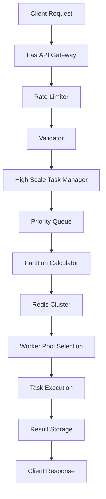
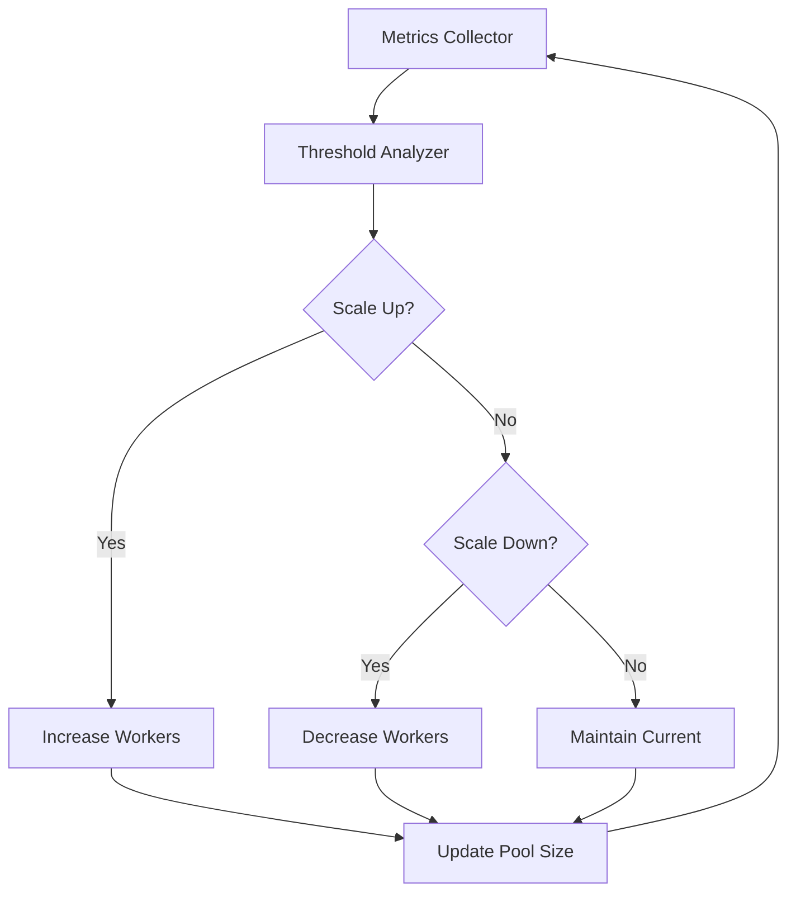
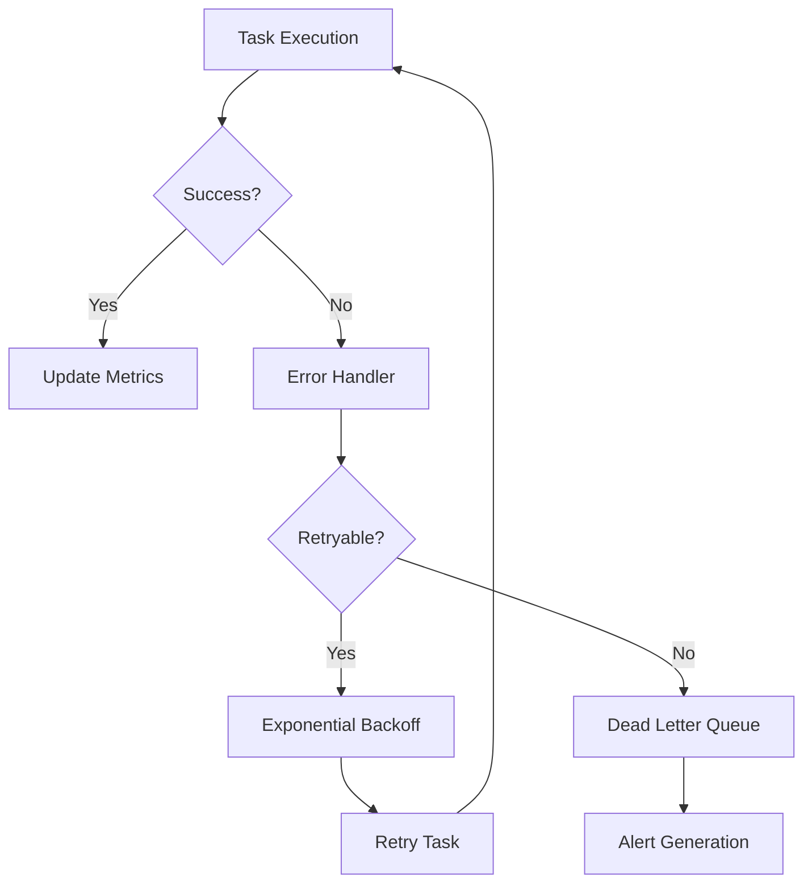

# 🏗️ Arquitectura del Sistema VokaFlow

## Resumen Ejecutivo

VokaFlow implementa una **arquitectura de microservicios distribuidos** diseñada para escalar horizontalmente y manejar millones de solicitudes por segundo. El sistema utiliza un patrón **Event-Driven Architecture** con **Redis Cluster** como backbone de distribución y **FastAPI** como capa de API.

## 📐 Principios de Diseño

### 1. **Escalabilidad Horizontal**
- **Redis Cluster**: Distribución automática de datos entre múltiples nodos
- **Worker Pools**: Especialización por tipo de carga (CPU, IO, Memory, Network)
- **Partitioning**: División de tareas en 16 particiones para distribución óptima
- **Load Balancing**: Distribución inteligente basada en carga actual

### 2. **Alta Disponibilidad**
- **Replicación**: Cada nodo maestro tiene réplicas
- **Failover Automático**: Recuperación ante fallos sin intervención manual
- **Circuit Breakers**: Protección contra fallos en cascada
- **Health Checks**: Monitoreo continuo de todos los componentes

### 3. **Observabilidad**
- **Métricas en Tiempo Real**: Recolección cada 10 segundos
- **Logging Centralizado**: Logs estructurados con niveles de severidad
- **Alerting**: Sistema de alertas basado en umbrales configurables
- **Tracing**: Seguimiento de tareas desde inicio hasta completión

### 4. **Tolerancia a Fallos**
- **Graceful Degradation**: Funcionamiento reducido ante fallos parciales
- **Retry Logic**: Reintentos automáticos con backoff exponencial
- **Isolation**: Fallos en un componente no afectan otros
- **Recovery**: Recuperación automática ante restauración de servicios

## 🔧 Componentes del Sistema

### 1. API Gateway (FastAPI)

```python
# Responsabilidades:
- Rate Limiting por categoría
- Validación de entrada 
- Autenticación y autorización
- Load balancing de requests
- Logging de audit trail
```

**Características:**
- **Concurrencia**: 50,000 conexiones simultáneas
- **Throughput**: 1,000,000+ requests/segundo
- **Latencia**: < 10ms p99
- **Availability**: 99.9% SLA

### 2. High Scale Task Manager

```python
# Componentes principales:
class HighScaleTaskManager:
    - Priority Queue Management (8 niveles)
    - Worker Pool Orchestration (5 tipos)
    - Redis Cluster Integration
    - Auto-scaling Logic
    - Circuit Breaker Implementation
    - Metrics Collection
```

**Funcionalidades:**
- **Priorización**: 8 niveles desde EMERGENCY (100ms) hasta MAINTENANCE (2h)
- **Distribución**: Hash-based partitioning para distribución uniforme
- **Scaling**: Auto-scaling basado en métricas de CPU, memoria y queue length
- **Monitoring**: Métricas en tiempo real de throughput y latencia

### 3. Redis Cluster

```bash
# Configuración del cluster:
Nodos: 6 (3 masters + 3 slaves)
Puertos: 7000-7005
Slots: 16,384 distribuidos automáticamente
Replicación: 1 slave por master
Persistencia: AOF + RDB snapshots
```

**Arquitectura de Datos:**

```
┌─────────────────────────────────────────────────────────┐
│                    Redis Cluster                       │
├─────────────────────────────────────────────────────────┤
│                                                         │
│  Master 7000        Master 7001        Master 7002     │
│  Slots: 0-5460     Slots: 5461-10922   Slots: 10923-   │
│       │                   │              16383         │
│       │                   │                │           │
│  Slave 7003        Slave 7004        Slave 7005       │
│                                                         │
└─────────────────────────────────────────────────────────┘
```

### 4. Worker Pools

#### CPU Intensive Pool
```python
# Configuración:
Type: ProcessPool
Max Workers: psutil.cpu_count() * 2
Use Cases: Machine Learning, Heavy Computations
Isolation: Process-level para evitar GIL
```

#### IO Intensive Pool  
```python
# Configuración:
Type: ThreadPool
Max Workers: psutil.cpu_count() * 16
Use Cases: File Operations, Database Access
Concurrency: Thread-based para I/O bound tasks
```

#### Memory Intensive Pool
```python
# Configuración:
Type: ThreadPool
Max Workers: psutil.cpu_count() * 4
Use Cases: Large Data Processing, Caching
Memory Limit: Monitored per task
```

#### Network Intensive Pool
```python
# Configuración:
Type: ThreadPool
Max Workers: psutil.cpu_count() * 32
Use Cases: API Calls, HTTP Requests
Connection Pooling: HTTP connection reuse
```

#### General Purpose Pool
```python
# Configuración:
Type: ThreadPool
Max Workers: psutil.cpu_count() * 8
Use Cases: General tasks, Mixed workloads
Flexibility: Handles multiple task types
```

### 5. Monitoring System

```python
# Arquitectura de monitoreo:
ProductionMonitor:
    - System Metrics (CPU, Memory, Disk, Network)
    - Redis Cluster Health (per node)
    - Task Metrics (throughput, latency, errors)
    - Alert Generation (threshold-based)
    - Log Aggregation (structured logging)
```

## 📊 Flujo de Datos

### 1. Task Submission Flow



### 2. Auto-scaling Flow



### 3. Fault Tolerance Flow



## 🔐 Seguridad

### 1. Network Security
- **TLS 1.3**: Encriptación end-to-end
- **VPC**: Isolation en redes privadas
- **Firewall**: Access control por IP/puerto
- **Rate Limiting**: Protección contra DDoS

### 2. Authentication & Authorization
- **JWT Tokens**: Stateless authentication
- **RBAC**: Role-based access control
- **API Keys**: Per-client authentication
- **Audit Logging**: Complete audit trail

### 3. Data Security
- **Encryption at Rest**: Redis data encryption
- **Encryption in Transit**: All inter-service communication
- **PII Protection**: Sensitive data handling
- **Backup Encryption**: Encrypted backups

## 📈 Performance Optimization

### 1. Caching Strategy
```python
# Multi-level caching:
L1: In-memory (LRU, 100MB per worker)
L2: Redis (Hot data, 1GB per node)  
L3: Persistent storage (Cold data)
```

### 2. Connection Pooling
```python
# Pool configurations:
Redis: 100 connections per pool
HTTP: 50 connections per pool
Database: 25 connections per pool
```

### 3. Async Optimization
```python
# Async patterns:
- Non-blocking I/O for all operations
- Connection pooling with aiohttp
- Async Redis operations
- Background task processing
```

## 🚦 Deployment Patterns

### 1. Blue-Green Deployment
```yaml
# Configuración:
Blue Environment: Current production
Green Environment: New version staging
Switch: DNS/Load balancer routing
Rollback: Instant switch back to blue
```

### 2. Canary Deployment
```yaml
# Configuración:
Canary: 5% of traffic to new version
Monitor: Error rates, latency, throughput
Gradual: 5% -> 25% -> 50% -> 100%
Rollback: Automatic if metrics degrade
```

### 3. Rolling Updates
```yaml
# Configuración:
Batch Size: 1 instance at a time
Health Check: Wait for healthy before next
Zero Downtime: Load balancer handles routing
Rollback: Previous version containers kept
```

## 🔍 Monitoring & Alerting

### 1. Key Metrics
```python
# Business Metrics:
- Tasks per second
- Average latency
- Error rate
- Queue depth

# System Metrics:
- CPU utilization
- Memory usage
- Disk I/O
- Network throughput

# Redis Metrics:
- Connection count
- Memory usage
- Keyspace operations
- Replication lag
```

### 2. Alert Thresholds
```json
{
  "critical": {
    "error_rate": "> 5%",
    "latency_p99": "> 1000ms",
    "cpu_usage": "> 90%",
    "memory_usage": "> 95%"
  },
  "warning": {
    "error_rate": "> 1%", 
    "latency_p99": "> 500ms",
    "cpu_usage": "> 80%",
    "memory_usage": "> 85%"
  }
}
```

### 3. Dashboards
- **System Overview**: High-level health metrics
- **Performance**: Latency and throughput trends
- **Errors**: Error rates and failure analysis
- **Capacity**: Resource utilization and scaling

## 🔮 Futuras Mejoras

### 1. **Multi-Region Deployment**
- Redis Cluster replication across regions
- Geographic load balancing
- Data locality optimization

### 2. **Machine Learning Integration**
- Predictive auto-scaling
- Anomaly detection
- Intelligent load balancing

### 3. **Advanced Observability**
- Distributed tracing with OpenTelemetry
- Custom metrics with Prometheus
- Advanced alerting with machine learning

### 4. **Performance Optimizations**
- WebAssembly for CPU-intensive tasks
- GPU acceleration for ML workloads
- Custom protocol for internal communication 